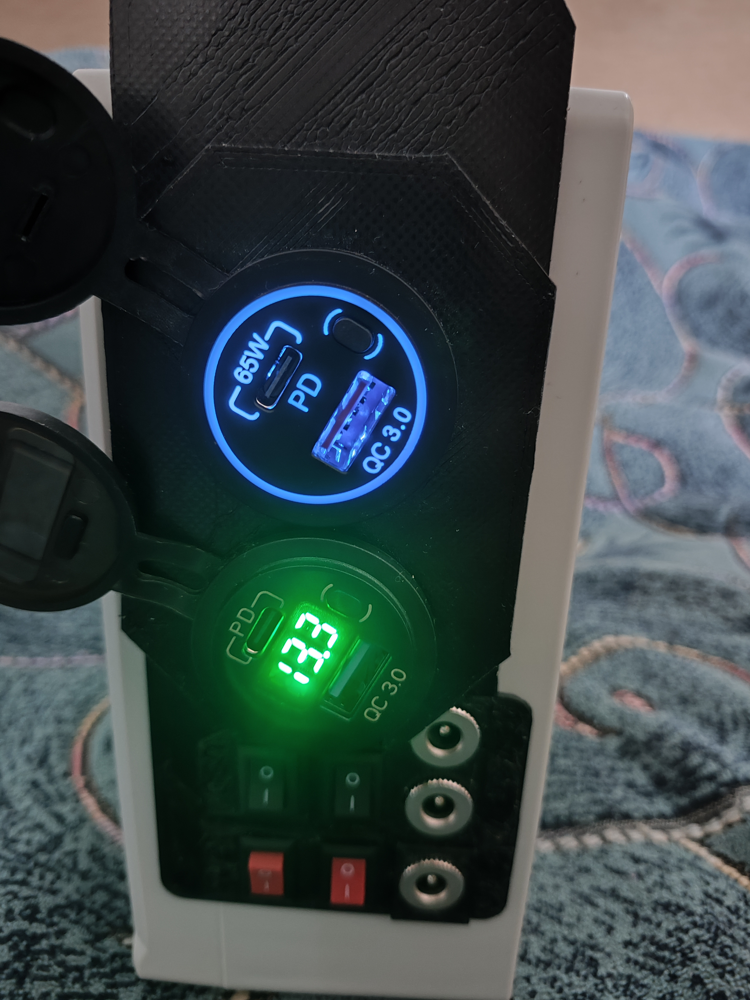

# My Engineering Projects Portfolio 🛠️

Welcome to my technical repository. Here is a curated list of my designs, ranging from high-end audio to field-ready power systems.

| Project Preview | Description & Links |
| :---: | :--- |
|  | **Field-Ready 12V 25Ah LiFePO4 Power Station**    High-capacity portable power solution with Daly Active Balancer, 65W PD, and integrated LED handle. Designed for field durability.    [**Details & Documentation →**](./power-station/) |
|  | **Modular 4-Channel Audio Preamplifier**    A Hi-Fi preamp project featuring independent transformer power supplies, headphone amplifier, and low-noise signal switching.    [**Details & Documentation →**](./preamp/) |
|  | **FPV Drone Systems & Custom Accessories**    Collection of drone builds and custom-designed STL components (mounts, spacers) optimized for SolidWorks and 3D printing.    [**Details & Documentation →**](./drones/) |

---
## 🛠️ Tech Stack & Skills
* **CAD/MCAD:** SolidWorks (3D Modeling, Assemblies, 3D PDF).
* **ECAD/Simulation:** NI Multisim, DipTrace (PCB Design & Schematics).
* **Hardware:** LiFePO4 Systems, BMS/Active Balancing, Audio Circuitry.
