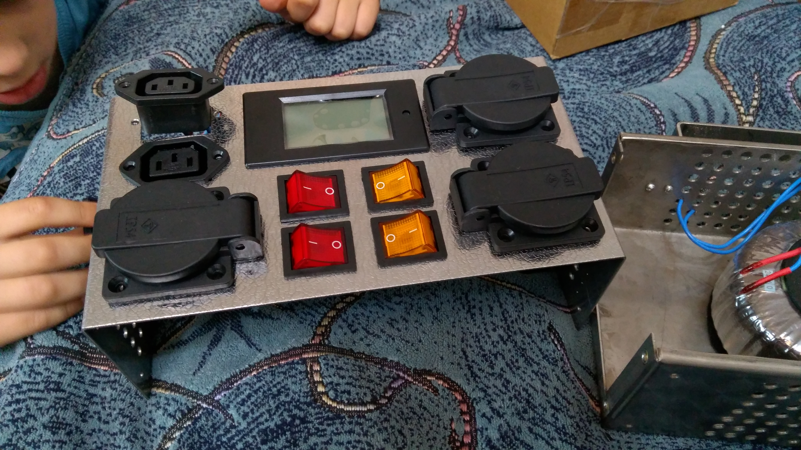
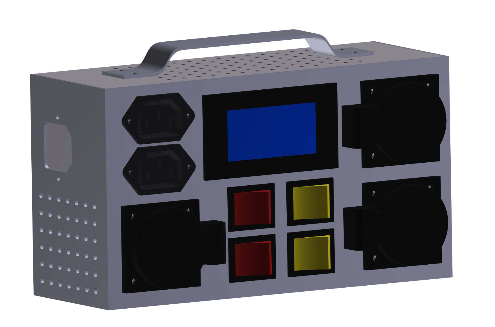
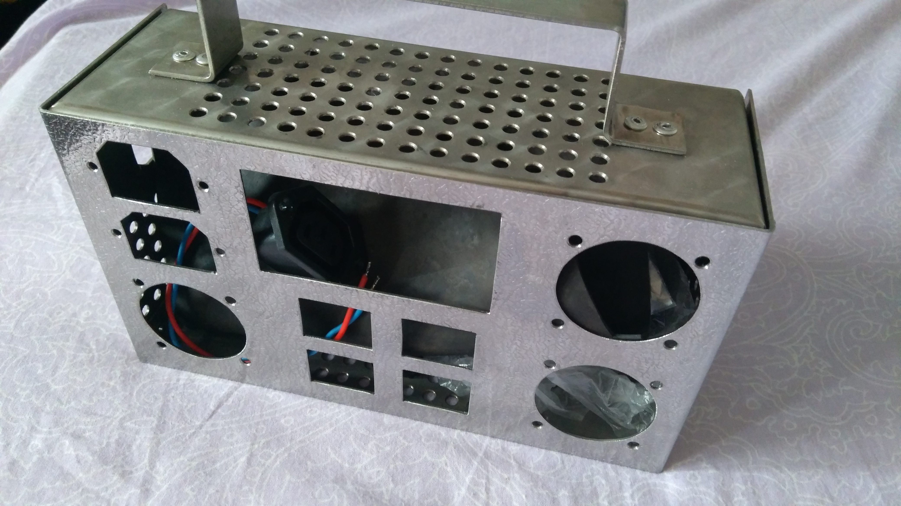
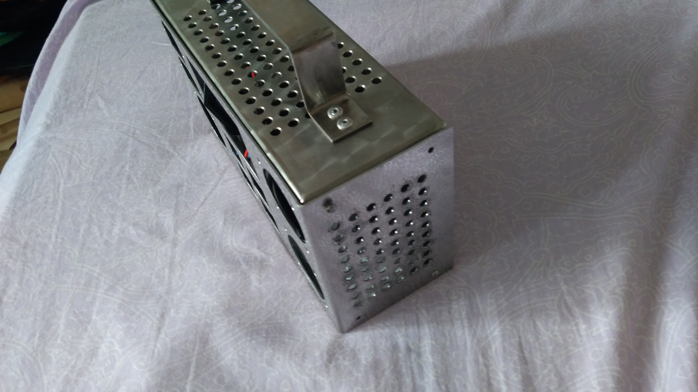
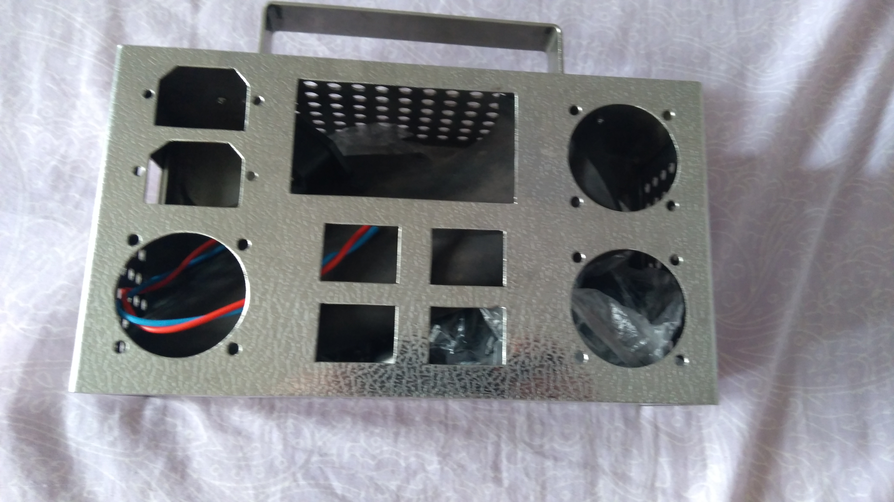
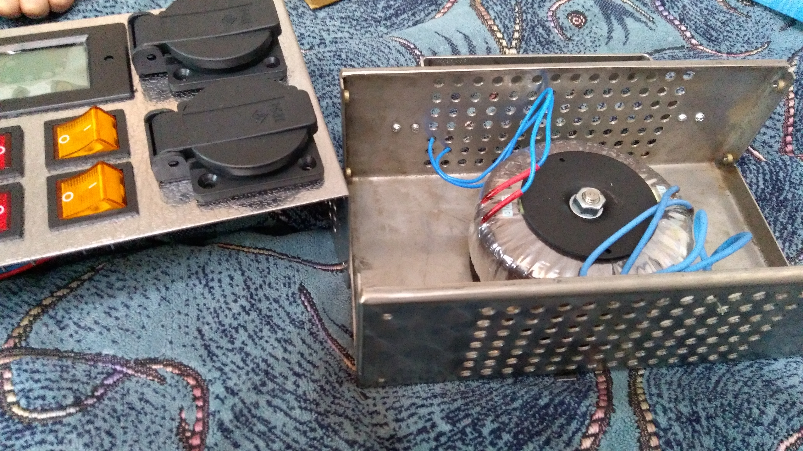
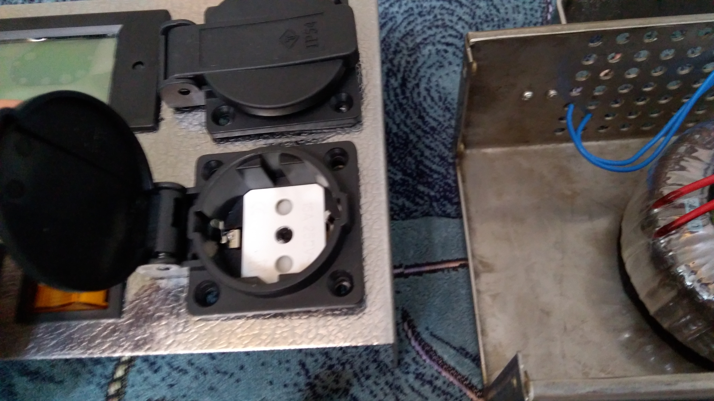
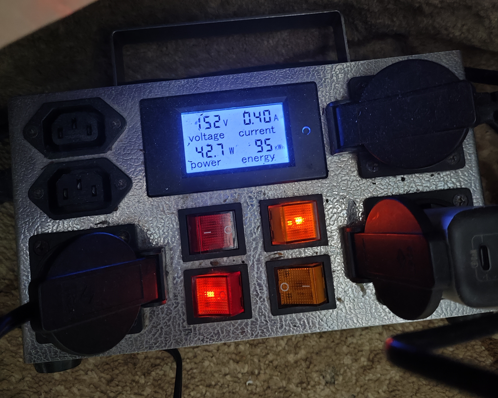
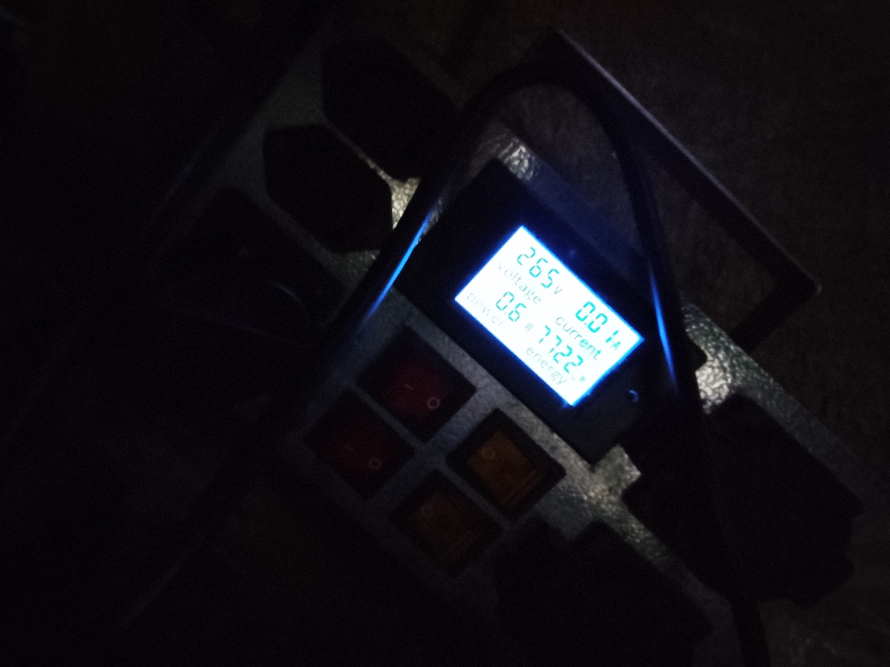

# Laboratory Galvanic Isolation Unit
## Project Overview
### This device is designed for safe diagnostic procedures on high-voltage equipment. It provides complete galvanic isolation from the mains, preventing ground loops and short circuits when using grounded oscilloscopes on "hot" circuits.

## Technical Architecture
* **Core:** High-efficiency 220V to 220V isolation transformer.

* **Monitoring:** Integrated digital AC multimeter (Voltage, Current, Power, Energy consumption).

* **Chassis:** Custom stainless steel enclosure for durability and EMI shielding.

## Functionality & Controls
The unit is divided into two operational zones with independent logic:

**1. Primary Zone (Direct):**

* 3x Standard AC outlets connected after the power meter but before the transformer.

* Controlled by Red switches.

**2. Isolated Zone (Safety):**

* 2x AC outlets connected to the secondary winding of the isolation transformer.

* Controlled by Yellow switches for visual distinction.

## Safety Features
**Oscilloscope Safety:** Allows for measuring the "hot" side of switching power supplies without the risk of damaging the probe or the mains circuit.

**Soldering Protection:** Provides additional isolation for soldering iron tips, protecting sensitive CMOS components from potential leakage currents.

---

## 📐 3D Design & Interactive Model
To provide a comprehensive view of the mechanical assembly, an interactive 3D PDF is available.

* [**Download 3D Interactive Assembly (PDF)**](documents/LGIU_3D_model.PDF)
    * *Note: Interactive features require Adobe Acrobat Reader. After opening, click "Trust this document" to activate the 3D view.*

  
   <em>Visual preview of the internal layout and handle assembly.</em>

---

## 🛠️ Build Process & Internal Layout

  
<b>Click to expand: Step-by-step Assembly Photos</b>

 

    
    
    
  

 
  

    
    
    
  

  
 

    
    
    
  
   
  

