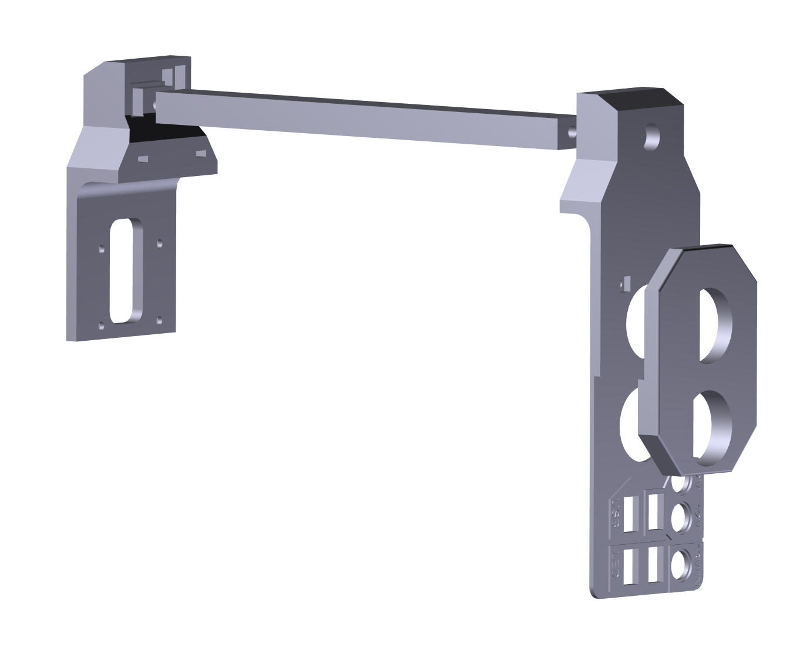

# Field-Ready 12V 25Ah LiFePO4 Power Station with Active Balancing
## Project Overview ##
This project is a rugged, multi-functional portable power solution designed for demanding field conditions. It leverages the safety and longevity of LiFePO4 chemistry, managed by a professional BMS and active balancing system, to provide reliable power for various devices, from smartphones to direct 12V equipment.

---

## Technical Specifications & Features
### ⚡ Core Power System

* **Battery:** LiFePO4 4S configuration (12.8V Nominal).
* **Capacity:** 25Ah.
* **Battery Management:** Integrated BMS (Battery Management System) for core protection.
* **Balancing:** Daly Active Balancer installed to ensure cell voltage parity, maximizing battery life and usable capacity.

###  🔌 Output Interfaces & Power Conversion
The unit features a versatile output array, optimized for different use cases:

**1. USB Charging (2x Modules):**

* High-speed charging with Quick Charge 3.0 (QC 3.0) support.

* Integrated 65W Power Delivery (PD) over USB-C for charging laptops and other high-power devices.

* Independent blue LED status illumination.

**2. DC 12V Outputs (2x Ports):**

* Standard DC 5.5x2.1mm jacks.

* Equipped with integrated Buck-Boost (Up/Down) DC-DC converters, ensuring a stable 12V output regardless of the battery's state of charge.

**3. High-Current Bi-Directional Port (1x Port):**

* Unstabilized direct connection from the BMS.

* Designed for high-current applications or for charging the station itself.

### 💡 Integrated Utility
* **High-Intensity LED Flashlight:** Seamlessly integrated into the carry handle for ergonomic, hands-free illumination when the station is set down.

### 🛡️ User Interface & Safety
* **Real-time Voltmeter:** Bright green digital display on the front panel provides instant battery voltage feedback.

* **Independent Switching:** Key functional groups (USB modules, DC outputs, flashlight) feature dedicated, protected on/off switches, minimizing standby power consumption.

* **Weather Protection:** All front panel output ports feature integrated rubber dust covers.

---

## 🛠️ Build Process & Internal Layout

  
<b>Click to expand: Step-by-step Assembly Photos</b>

  

    
    
    
  

  

    
    
  

  

    <b>Engineering Note:</b> During the assembly, special attention was paid to wire management and insulation. 
    I used a <b>Daly Active Balancer</b> alongside the BMS to ensure long-term cell health. 
    All high-current paths are reinforced and fused for maximum safety.
  

### 📐 3D Design & Interactive Model
To provide a comprehensive view of the mechanical assembly, an interactive 3D PDF is available.

* [**Download 3D Interactive Assembly (PDF)**](./3d_for_lifepo4_Power_B_25Ah%20.PDF)
    * *Note: Interactive features require Adobe Acrobat Reader. After opening, click "Trust this document" to activate the 3D view.*

  
   <em>Visual preview of the internal layout and handle assembly.</em>

